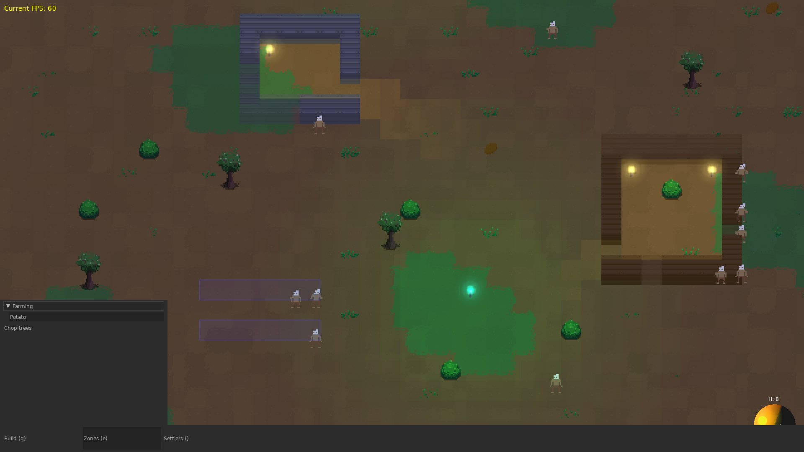

# Overseer
A colony manager simulator inspired by games like Dwarf Fortress and Rimworld.

Implemented using lua/love.

Heavily work in progress.

### Notable libs:
- [Concord](https://github.com/Tjakka5/Concord) (awesome ECS)
- [hump](https://github.com/vrld/hump)
- [lume](https://github.com/rxi/lume/blob/master/lume.lua)
- [batteries](https://github.com/1bardesign/batteries)
- [behaviourtree](https://github.com/tanema/behaviourtree.lua)
